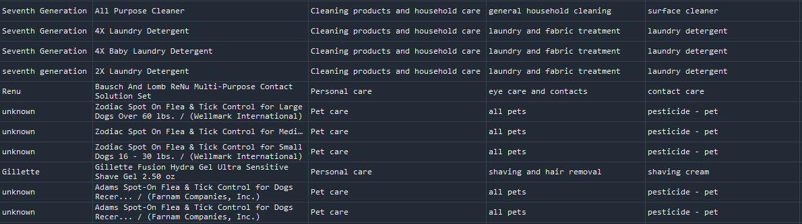
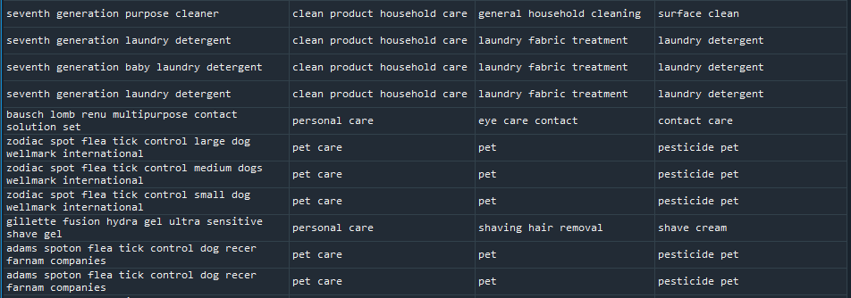

## How this Script Works
This document will breifly go though the steps that the script takes to make its predictions.

### Obtaining and cleaning training data
Product names and PUCS are pulled from factotum with the following query:
```sql
SELECT puc_id, product_id, brand_name, title, gen_cat, prod_fam, prod_type, description FROM ( SELECT brand_name, title, puc_id, product_id FROM (select id, brand_name, title from dashboard_product) as product INNER JOIN (select puc_id, product_id from dashboard_producttopuc) as prod_to_puc ON product.id = prod_to_puc.product_id ) as product_match INNER JOIN (select * from dashboard_puc) as puc ON product_match.puc_id = puc.id;
```
Cleaning is done using regular expressions to remove symbols and other irregularities, including some numbers and stopwords. The PUCs are also lemmatized and stopwords are removed.

**Before Cleaning:**


**After Cleaning:**


### Word embedding
In order to classify text using a machine learnig model, we need to be able to represent the text with some sort of numerical values. This script uses word embedding, which have the advantage of being able to account for similarities between different words. Pre-trained models also exist for word embedding models. In the context of this script, cleaned product names are loaded into a word embedding model, and a vector of numbers is given as the output to be used in further analysis. This vector is the aggregate of all the words in the product name.

As an example, if the product name is `extra fancy bleach`, the output array would be `array([-0.02843909, -0.05943272,  0.04102759, ...,  0.03814392, 0.04666945, -0.02749158], dtype=float32)` with a size of 4496 (length is dependent on the word embedding model used, not the document length).

### Modeling the PUC
Modeling is done with an SVM, with the vector representing the product name as the input. Given that PUCs have three seperate levels, a classifier was trained for each part. This means three models are used for each product to make a prediction. Because the higher level PUCs have a higher prediction accuracy, a misclassified product should still have a prediction that is more accurate that if only one classifier was used for each product. Additionally, bootstrap aggregation exists as an option in the script to guard against overfitting.
