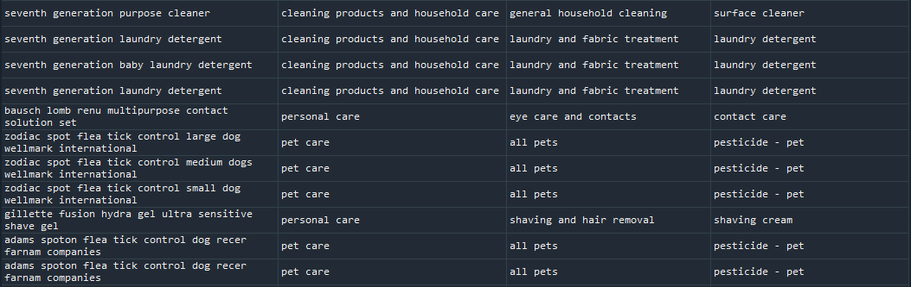

## How this Script Works
This document will briefly go though the steps that the script takes to make its predictions.

### Obtaining and cleaning training data
Product names and PUCS are pulled from factotum with the following query:
```sql
SELECT puc_id, product_id, brand_name, title, gen_cat, prod_fam, prod_type, description FROM ( SELECT brand_name, title, puc_id, product_id FROM (select id, brand_name, title from dashboard_product) as product INNER JOIN (select product_id, puc_id from ((select x1.product_id, puc_id, classification_method, classification_confidence as done from (select product_id, count(puc_id) from dashboard_producttopuc group by product_id having count(puc_id) > 1) as x1 INNER JOIN (select * from dashboard_producttopuc where classification_method = "MA") as x2 on x1.product_id = x2.product_id) UNION (select q3.product_id, puc_id, classification_method, classification_confidence as done from (select q6.product_id from (select q1.product_id, classification_confidence as done from (select product_id from dashboard_producttopuc group by product_id having count(puc_id) > 1) as q1 INNER JOIN (select * from dashboard_producttopuc where classification_method = "MA") as q2 on q1.product_id = q2.product_id) as q5 RIGHT JOIN (select product_id from dashboard_producttopuc group by product_id having count(puc_id) > 1) as q6 on q5.product_id = q6.product_id where done is null) as q3 INNER JOIN (select * from dashboard_producttopuc where classification_method = "MB") as q4 on q3.product_id = q4.product_id) UNION (select r1.product_id, puc_id, classification_method, classification_confidence as done from ((select product_id from dashboard_producttopuc group by product_id having count(puc_id) = 1) as r1 INNER JOIN (select * from dashboard_producttopuc where classification_method = "MB" or classification_method = "MA") as r2 on r1.product_id = r2.product_id))) as prod_to_puc_temp) as prod_to_puc ON product.id = prod_to_puc.product_id ) as product_match INNER JOIN (select * from dashboard_puc) as puc ON product_match.puc_id = puc.id;
```
In addition to pulling this data, this query deals with products that have more than 1 PUC. Other data groups are also pulled and combined with data from the above query to train the model on data that should not have PUCs (e.g pure chemicals).

Cleaning is done using regular expressions to remove symbols and other irregularities, including some numbers and stopwords. The PUCs are also lemmatized and stopwords are removed.

**Before Cleaning:**


**After Cleaning:**

*Process changed, PUC names no longer cleaned like this (need to update photo)

### Word embedding
In order to classify text using a machine learning model, we need to be able to represent the text with some sort of numerical values. This script uses word embedding, which have the advantage of being able to account for similarities between different words. Pre-trained models also exist for word embedding models. In the context of this script, cleaned product names are loaded into a word embedding model, and a vector of numbers is given as the output to be used in further analysis. This vector is the aggregate of all the words in the product name.

As an example, if the product name is `extra fancy bleach`, the output array would be `array([-0.02843909, -0.05943272,  0.04102759, ...,  0.03814392, 0.04666945, -0.02749158], dtype=float32)` with a size of 4496 (length is dependent on the word embedding model used, not the document length).

**Word similarity with word embedding**


### Modeling the PUC
Modeling is done with an SVM, with the vector representing the product name as the input. Given that PUCs have three separate levels, a classifier was trained for each part. This means three models are used for each product to make a prediction. Because the higher level PUCs have a higher prediction accuracy, a misclassified product should still have a prediction that is more accurate than if only one classifier were used for each product. Additionally, bootstrap aggregation exists as an option in the script to guard against variance in classes with only a few products.

**Example model definition**
```python
clf = svm.SVC(decision_function_shape='ovo', C=100,
              cache_size=20000, kernel='linear')
```
