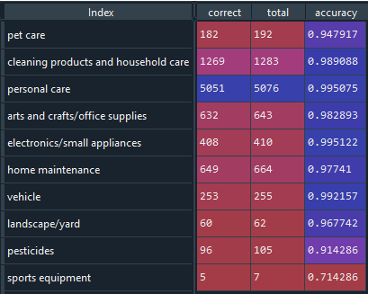
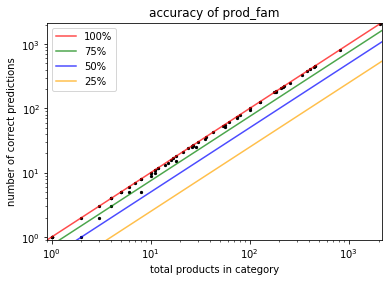
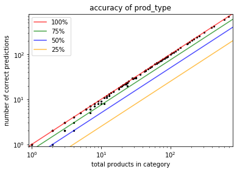
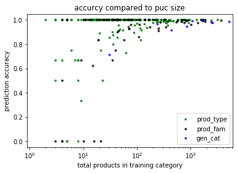

## Model Performance

### Accuracy
The following code was run to model for testing. For this test, 11 runs were aggregated, but the difference between 11 runs and something like 5 runs is not very large.
```python
from model_helper import model_build, model_run
import pandas as pd
import numpy as np
import joblib
from sklearn.model_selection import train_test_split

df = pd.read_csv('clean.csv', index_col='key')
df_train, df_test = train_test_split(df, test_size=0.2)
sen_test = df_test['name'].to_list()
model_build(df, df_train, bootstrap=True, num_runs=11, label='perform')
puclist = model_run(sen_test, 'perform')

PUC_act = df_test[['gen_cat', 'prod_fam', 'prod_type']].fillna('').apply(
    lambda x: x.to_list(), axis=1).to_list()
ct = np.array([0] * 3)
for i in range(len(puclist)):
    if puclist[i] == PUC_act[i]:
        ct += 1
    else:
        for n in range(3):
            if puclist[i][:n+1] == PUC_act[i][:n+1]:
                ct[n] += 1
ct = ct / len(puclist)
print(ct)
```
Results are as follows:
* **gen_cat accuracy:** 98.9%
* **prod_fam accuracy:** 97.9%
* **prod_type accuracy:** 97.0%

### Data Breakdown
We obtained a high accuracy using this model, but it would be helpful to break down the results a little bit more. One thing we can do is look at the accuracy of each category. This is important because some categories are very large, while others are very small.

Below we have a table showing the different classifications in `gen_cat`.



While the overall accuracy of the predictions was 98.9%, the average category accuracy was 94.8%. The table below summarizes this information for each PUC level. One important thing about this table is that errors are not double counted; if a product is misclassified into a PUC, it will count as an error in the first level that misclassified it, but not every level below. The goal of doing this is to gauge the performance of the model by removing things that are already misclassified. What this data tells me is that each model does equally well in predicting products within its PUC provided the product should be there in the first place.

| PUC Level | Overall Accuracy | Overall Accuracy (train_size > 10) | Overall Accuracy (train_size > 100) | Average Category Accuracy | Average Category Accuracy (train_size > 10) | Average Category Accuracy (train_size > 100) |
| :--- | :---: | :---: | :---: | :---: | :---: | :---: |
| `gen_cat` | 98.9% | 98.9% | 99.0% | 94.8% | 94.8% | 97.4% |
| `prod_fam` | 98.9% | 99.0% | 99.1% | 90.2% | 94.2%| 98.2% |
| `prod_type` | 99.1% | 99.3% | 99.5% | 94.2% | 94.2% | 98.9% |

The size limits in the table above were done by removing PUCs that had a training set smaller than a certain number. This would be a difficult limit to implement in reality, however, since the only way you could do it would be ignoring certain predictions. This would be unreliable. Even though the smaller PUCs bring more error, overall accuracy is still fairly high.

#### Graphs
Below are graphs for each PUC level, comparing the size of the test set to the number of correct predictions. The lines represent accuracy. These graphs do a good job of illustrating the distribution of accuracy in the different PUCs. With these graphs, it is implied that the size of the training set is proportional to the test set.






The graph below is a plot of the test set accuracy versus the size of the training set.


Note the logarithmic scales on each of these graphs. This means that PUCs with an accuracy of 0% will not show on the first three plots.
