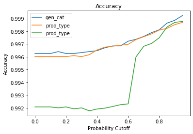
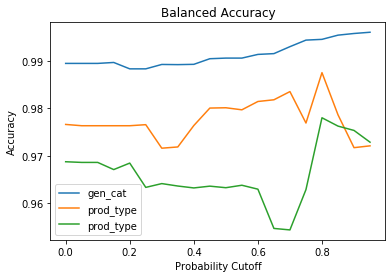
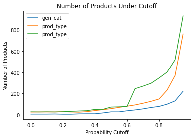
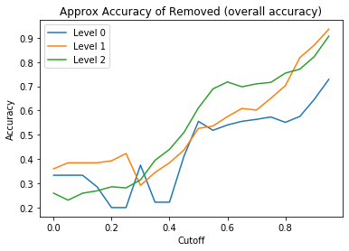
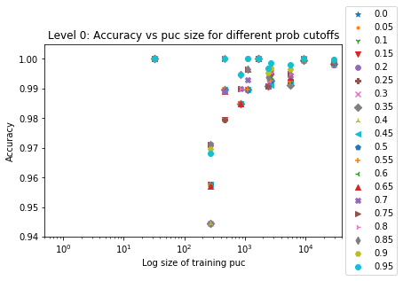

## Probability
When setting the correct flag when building the model, probability estimates will become available. The following charts show various pieces of information when test data under a certain probability threshold is removed. All of these charts were generated on the same set of data using the same models (13,385 samples in the test set).

Accuracy, [balanced accuracy](https://scikit-learn.org/stable/modules/generated/sklearn.metrics.balanced_accuracy_score.html), and the number of products removed in each level versus the probability cutoff. 

The accuracy of the products that were removed for the level in which it was removed.

Accuracy compared to PUC size for different cutoffs (note the x-axis is log)

