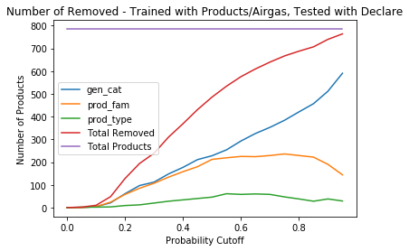

## Probability
When setting the correct flag when building the model, probability estimates will become available. The following charts show various pieces of information when test data under a certain probability threshold is removed. All of these charts were generated on the same set of data.

Accuracy, [balanced accuracy](https://scikit-learn.org/stable/modules/generated/sklearn.metrics.balanced_accuracy_score.html), and the number of products removed in each level versus the probability cutoff. 
 

 

 

The accuracy of the products that were removed for the level in which it was removed.
 

Below is a list of simple accuracies of `gen_cat` for each category. `not_applicable` consists of the Airgas and Declare datagroups.

| `gen_cat`  | Number in Test Set | Accuracy (with Airgas/Declare) | Accuracy (Products Only) |
| ------------- | ------------- | ------------- | ------------- |
| personal care  | 7437/7324  | 99.9% | 99.9% |
| cleaning products and household care | 1440/1421 | 99.1% | 99.6% |
| home maintenance | 710/728 | 98.0% | 99.0% |
| electronics/small appliances | 408/426 | 100% | 100% |
| not_applicable | 2690/N/A | 99.8% | N/A |
| arts and crafts/office supplies | 625/629 | 99.4% | 99.1% |
| vehicle | 278/290 | 96.8% | 98.6% |
| pet care | 197/197 | 98.0% | 99.4% |
| landscape/yard | 62/69 | 96.8% | 97.1% |
| pesticides | 106/121 | 98.1% | 95.9% |
| industrial ingredients | 7/9 | 100% | 100% |
| sports equiptment | 8/6 | 100% | 83.3% |
| industrial products | 5/5 | 60.0% | 80.0% |

There is always a possibility there will be a product that is outside the scope of the training set. To test the model's performance in this idea, the following graphs were generated. They represent the number of samples that get removed when the probability cutoff is set at certain values. The training/test sets are different with each plot. It is important to note that the PUC levels are separate (e.g. if a product is removed based on its prod_fam prediction, it will not be counted under gen_cat, and there could still be a prediction for gen_cat).

