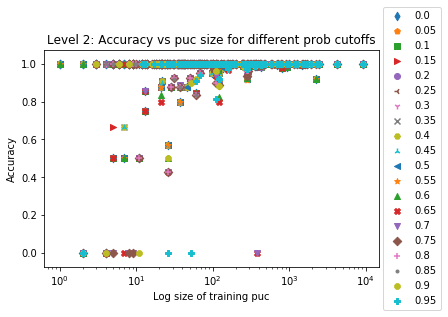

## Probability
When setting the correct flag when building the model, probability estimates will become available. The following charts show various pieces of information when test data under a certain probability threshold is removed. All of these charts were generated on the same set of data using the same models (13,973 samples in the test set).

Accuracy, [balanced accuracy](https://scikit-learn.org/stable/modules/generated/sklearn.metrics.balanced_accuracy_score.html), and the number of products removed in each level versus the probability cutoff. 
 

 

 

The accuracy of the products that were removed for the level in which it was removed.
 

Below is a list of simple accuracies of `gen_cat` for each category. `not_applicable` consists of the Airgas and Declare datagroups.

| `gen_cat`  | Number in Test Set | Accuracy (with Airgas/Declare) | Accuracy (Products Only) |
| ------------- | ------------- | ------------- | ------------- |
| personal care  | 7437/7324  | 99.9% | 99.9% |
| cleaning products and household care | 1440/1421 | 99.1% | 99.6% |
| home maintenance | 710/728 | 98.0% | 99.0% |
| electronics/small appliances | 408/426 | 100% | 100% |
| not_applicable | 2690/N/A | 99.8% | N/A |
| arts and crafts/office supplies | 625/629 | 99.4% | 99.1% |
| vehicle | 278/290 | 96.8% | 98.6% |
| pet care | 197/197 | 98.0% | 99.4% |
| landscape/yard | 62/69 | 96.8% | 97.1% |
| pesticides | 106/121 | 98.1% | 95.9% |
| industrial ingredients/9 | 7 | 100% | 100% |
| sports equiptment | 8/6 | 100% | 83.3% |
| industrial products | 5/5 | 60.0% | 80.0% |

Accuracy compared to PUC size for different cutoffs (note the x-axis is log). Note: These were made with the old test set
 

 

 
